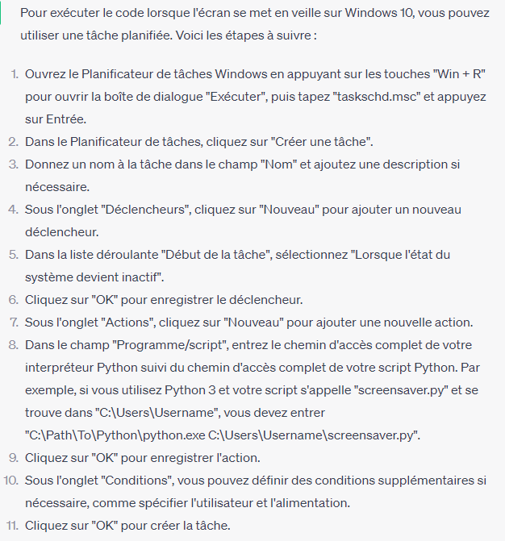
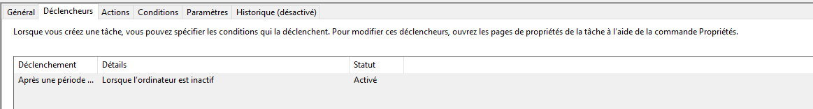
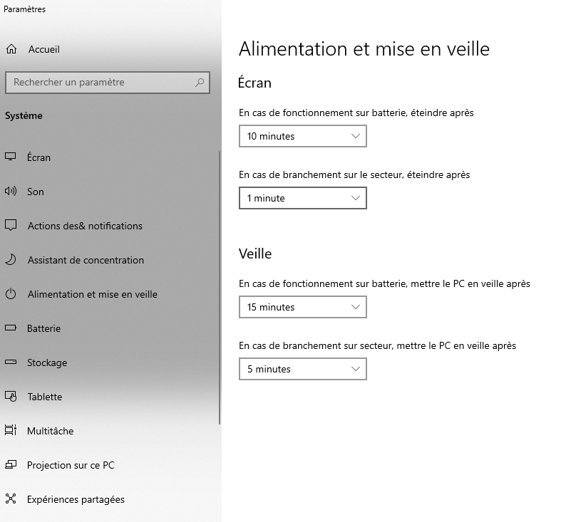

# Marche a suivre
## Telecharger les paquets nécessaires

Exécuter ce code :<br>
```pip install -r requirements.txt```

## Executer le code lorsque l'écran se met en veille sur W10

<br>
Pour le declencheur :

<br>
Pour l'explication :

<br>
Pour la mise en veille du pc, éteindre l'écran avant la mise en veille, exemple :


## Si erreur de lancement:
Selectionner dans le plannificateur dans l'action lancer le code avec le fichier .bat,
"launch_main_w10.bat"<br>